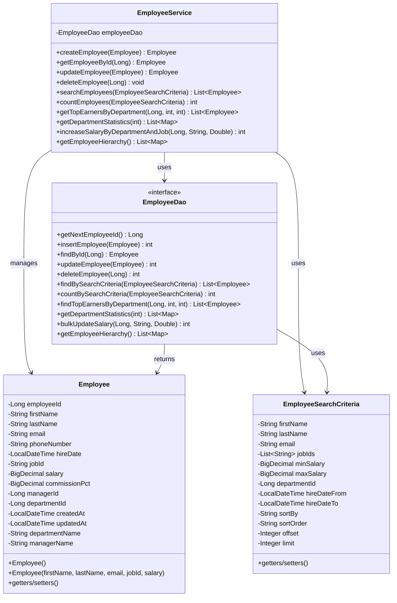
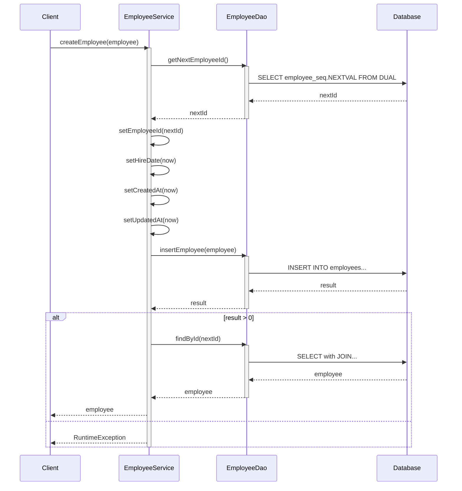
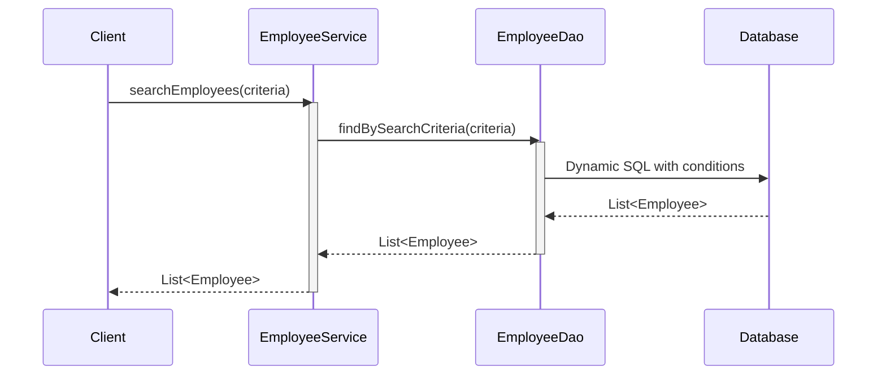
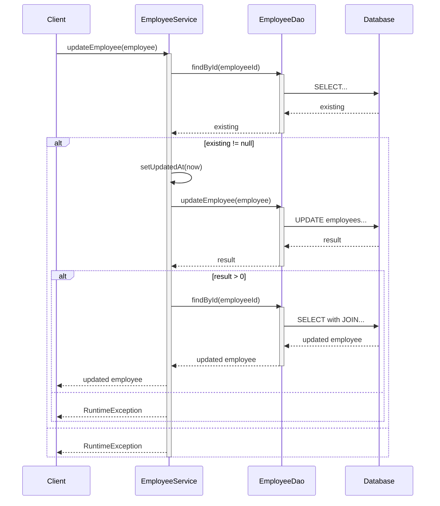
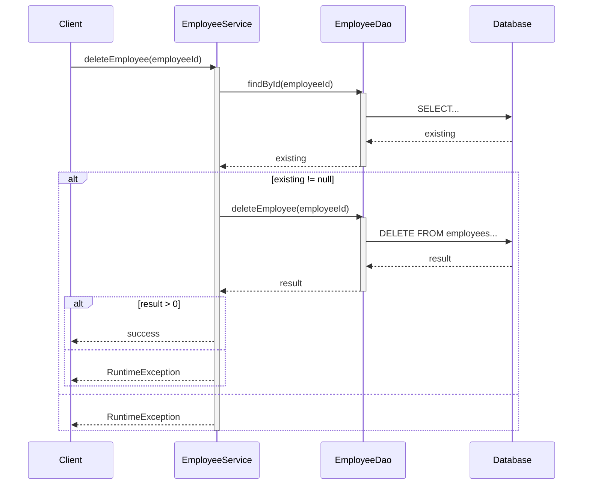

# Employee Management System - アーキテクチャドキュメント

## システム概要

Spring + MyBatisを使用した従業員管理システムのアーキテクチャ図です。

## クラス図

## シーケンス図

### 従業員作成処理

### 従業員検索処理

### 従業員更新処理

### 従業員削除処理

## アーキテクチャの特徴

- **レイヤードアーキテクチャ**: Service層とDAO層の分離
- **MyBatis統合**: アノテーションベースのSQLマッピング
- **トランザクション管理**: Spring @Transactionalによる宣言的トランザクション
- **Oracle固有機能**: SEQUENCE、ROWNUM、階層クエリなどを使用
